 **Завдання:**
 
Продемонструвати можливість імітувати зміну мережевих налаштувань у режимі реального часу, наприклад, віддалено вмикати або вимикати правила, а також виявляти конфліктні чи дубльовані правила. 

1. Запуск сервісу.  
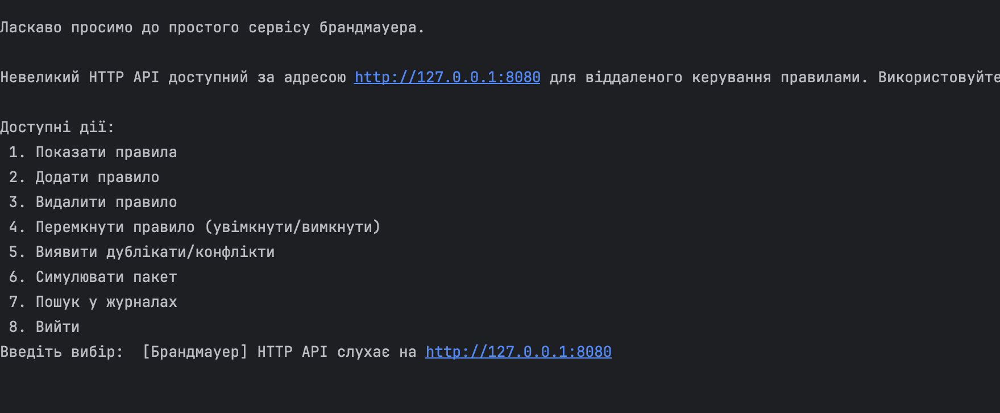

2. Створення правила. Припустимо, ми хочемо заблокувати доступ на порт 22 (SSH) до сервера 10.0.0.5 з будь‑яких IP. 
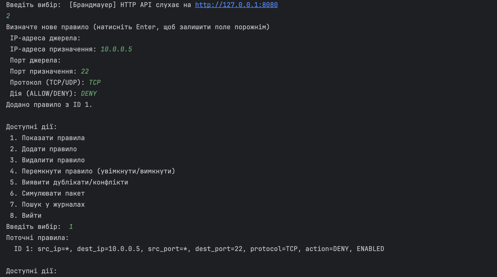

3. Імітація пакета. Тепер перевіримо, що брандмауер блокує відповідні пакети. 
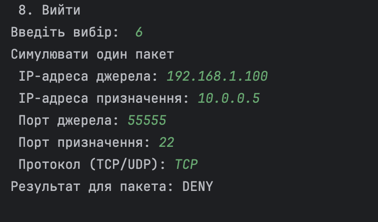

4. Програма створить запис у файлі firewall.log, оскільки пакет заблоковано. Перегляд журналу. 
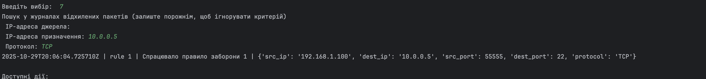

5. Зміна правила. Припустимо, я хочу тимчасово  дозволити SSH. Виберу пункт 4 і введу ID правила (наприклад, 1). Статус зміниться на DISABLED. 
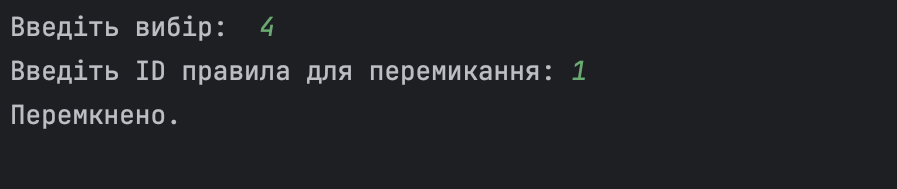

6. Повторимо крок 5: у цьому випадку пакет буде дозволено (ALLOW), а запис у журналі не з’явиться.
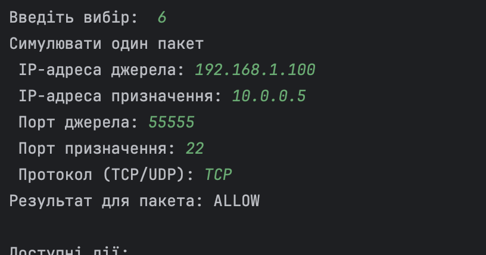

7. Додавання та виявлення конфліктного правила до першого яке додали в пункі 2. 
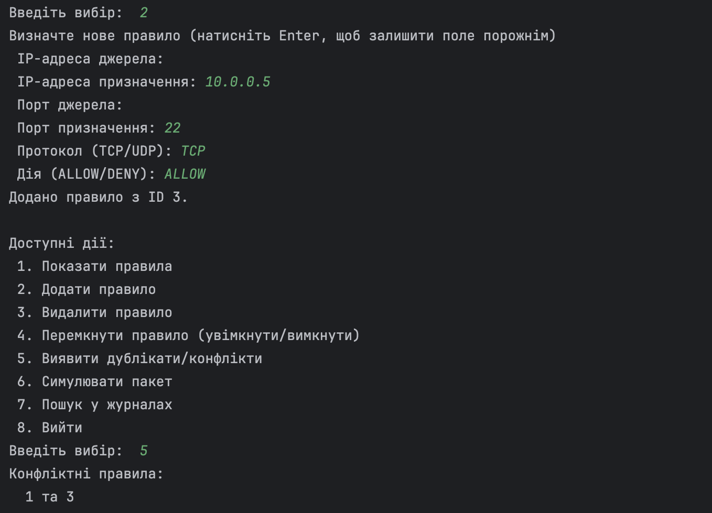

8. Видалення конфліктного правила.
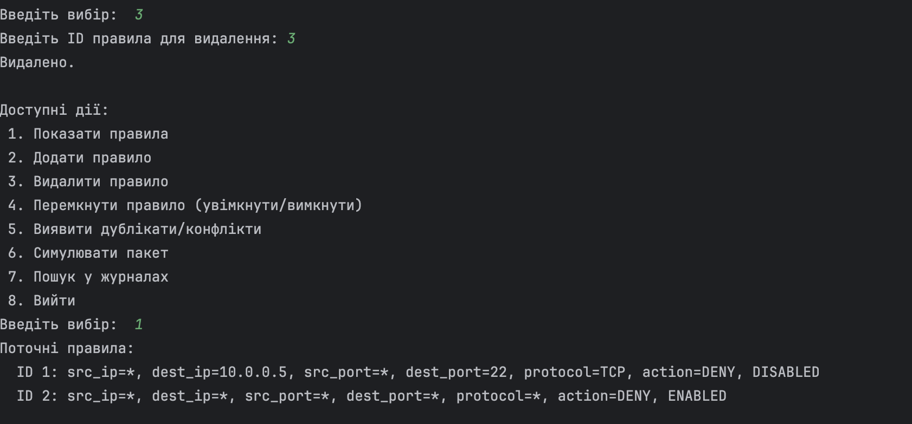

9. Виявлення дубльованих правих.
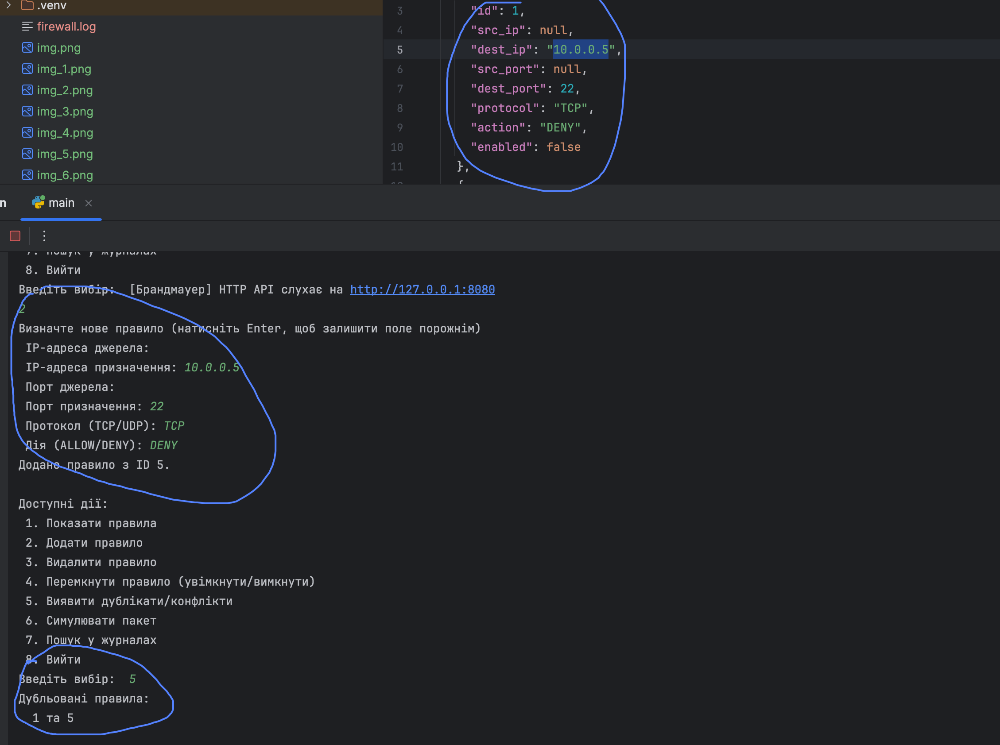

10. Імітувати зміну мережевих налаштувань у режимі реального часу.
10.1. Додав правило для блокування порту 22 через API:
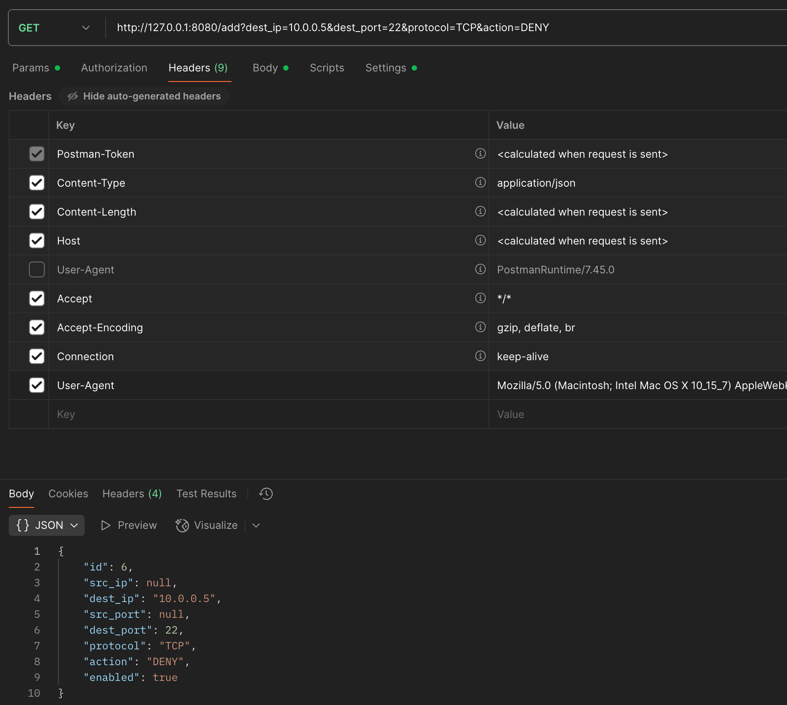

10.2. Не вимикаючи програму - симулюю пакет через Console UI
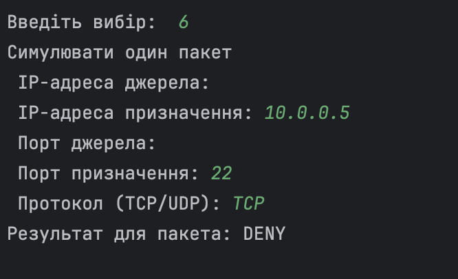

10.3. Вимикаю правило через API
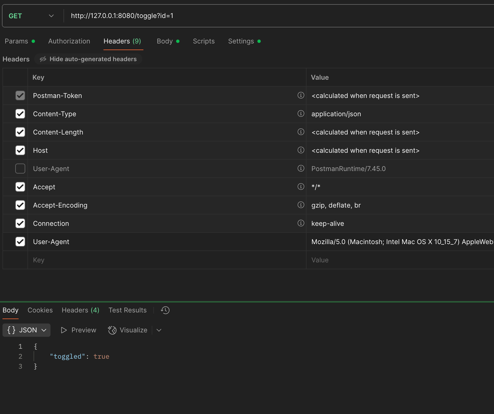

10.4. Не вимикаючи програму - симулюю пакет через Console UI - результат є Allow 
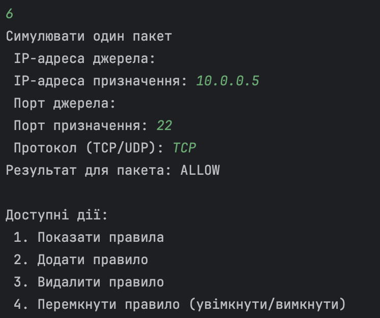
